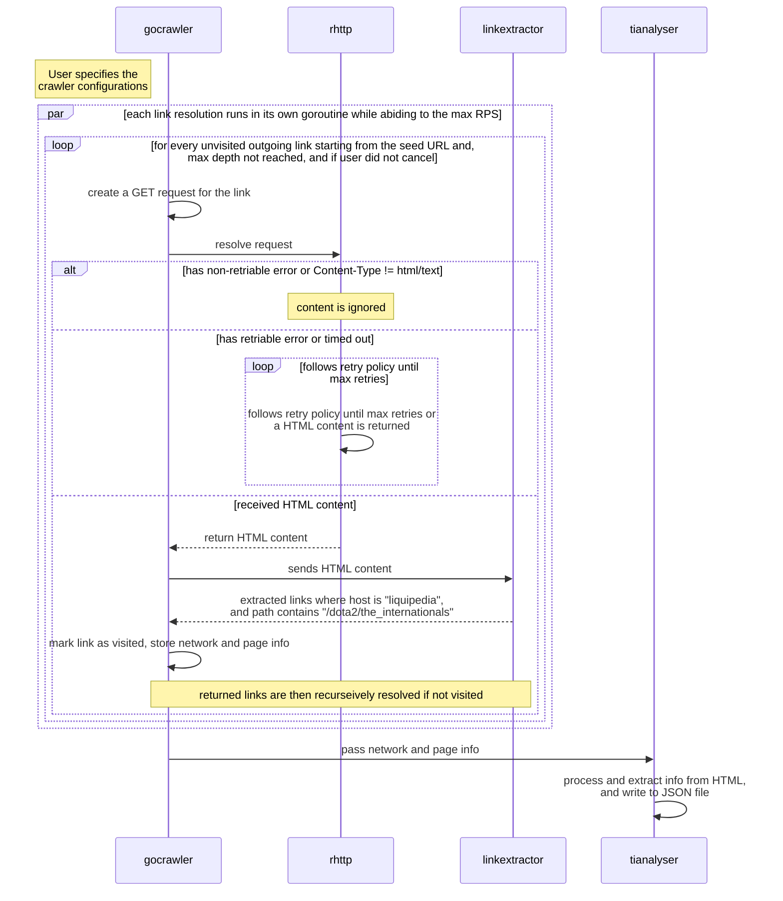

# CS3103 Golang Webcrawler

This repo contains the source code for a generic parallel webcrawler written in Golang. In this directory there are 3 examples of how the crawler can be used as a package:

| Example      | Description                                                                                                                                | Sample Output                                                                                         |
| ------------ | ------------------------------------------------------------------------------------------------------------------------------------------ | ----------------------------------------------------------------------------------------------------- |
| `explorer`   | Starting from any seed URL(s), crawl and collect all outgoing links until max depth, all links have been exhausted, or if the user cancels | [`link`](https://github.com/yusufaine/cs3103-gocrawler/blob/main/example/explorer/example.com.json)   |
| `sitemapper` | Starting from a single URL, crawl all accessible sites if it contains the the host has been fully crawled, or if the user cancels          | [`link`](https://github.com/yusufaine/cs3103-gocrawler/blob/main/example/sitemapper/example.com.json) |
| `tianalyser` | Crawls from [Liquipedia](https://liquipedia.net/dota2/The_International) and extract all the country's representative information          | [`link`](https://github.com/yusufaine/cs3103-gocrawler/blob/main/example/tianalyser/tianalyser.json)  |

As part of our CS3103 mini-project, we continued building on top of the webcrawler to analyse the relevance of each country and region when it comes to the topic of "The International", a global DOTA 2 tournament, over the past few years based on what can be found on.

<!-- omit in toc -->
## Table of Contents

- [Components](#components)
  - [`crawler`](#crawler)
  - [`rhttp`](#rhttp)
- [Usage](#usage)
  - [Sequence Diagram](#sequence-diagram)
- [Members](#members)
- [Acknowledgements](#acknowledgements)

## Components

### `crawler`

A concurrent web crawler that crawls a given URL and returns a list of URLs found on the page based on a default `LinkExtractor` method which users can override.

### `rhttp`

A simple wrapper over `net/http` that provides a few default backoff and retry policies that can also easily extend to a user's need.

## Usage

> [!IMPORTANT]
> We recommend downloading the binary from the [releases page](https://github.com/yusufaine/gocrawler/releases). If you have a proxy, you can specify it using the `--proxy` flag and increase the `--rps` to account for the different proxies that will be used. Please ensure that the RPS per proxy is kept to at most 2 per second, in accordance to Liquipedia's [Terms of Use](https://liquipedia.net/api-terms-of-use).

Refer to [`example/tianalyser/ti_stats.json`](https://github.com/yusufaine/cs3103-gocrawler/blob/main/example/tianalyser/tianalyser.json) for an example of the output for the command below.

```bash
# Running the binary
./tianalyser \
  --depth=5 \ 
  --report=example/tianalyser/ti_stats.json \ 
  --rps=0.5

# ./tianalyser --help to see all options

# Without binary (requires Go 1.20+)
go run example/tianalyser/main.go \ 
  --depth=5 \ 
  --report=example/tianalyser/ti_stats.json \ 
  --rps=0.5
```

### Sequence Diagram

> [!NOTE]
> This is a rough outline of how the `tianalyser` works and mainly shows the happy path.



## Members

| **Name**              |
| :-------------------- |
| Aryaa Adee Sandeep    |
| Jacob Kwan            |
| Ryan Aidan Jayasuriya |
| Yusuf Bin Musa        |

## Acknowledgements

- [Liquipedia](https://liquipedia.net/dota2/The_International) for providing the data for our project
- [Example usage of goquery](https://www.flysnow.org/2018/01/20/golang-goquery-examples-selector) for helping us understand how to use goquery
- [charmbracelet/log](https://github.com/charmbracelet/log) for making logging less boring
