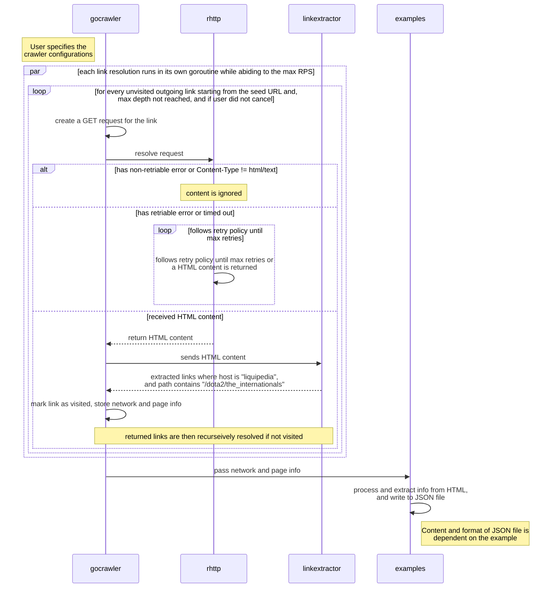

# CS3103 G46 Golang Webcrawler

This repo contains the source code for a generic parallel webcrawler ([project root](https://github.com/yusufaine/gocrawler/tree/main)) written in Golang. As part of our CS3103 mini-project, we continued building on top of the webcrawler to analyse the relevance of each country and region when it comes to the topic of "The International", a global DOTA 2 tournament, over the past few years based on what can be found on.

| Example      | Description                                                                                                                                |
| ------------ | ------------------------------------------------------------------------------------------------------------------------------------------ |
| `explorer`   | Starting from any seed URL(s), crawl and collect all outgoing links until max depth, all links have been exhausted, or if the user cancels |
| `sitemapper` | Starting from a single URL, crawl all accessible sites if it contains the the host has been fully crawled, or if the user cancels          |
| `tianalyser` | Crawls from [Liquipedia](https://liquipedia.net/dota2/The_International) and extract all the country's representative information          |

<!-- omit in toc -->
## Table of Contents

- [Components](#components)
  - [`crawler`](#crawler)
  - [`rhttp`](#rhttp)
- [`gocrawler` sequence diagram](#gocrawler-sequence-diagram)
- [Usage](#usage)
  - [`explorer`](#explorer)
  - [`sitemapper`](#sitemapper)
  - [`tianalyser`](#tianalyser)
- [Members](#members)
- [Acknowledgements](#acknowledgements)

## Components

### `crawler`

A concurrent web crawler that crawls a given URL and returns a list of URLs found on the page based on a default `LinkExtractor` method which users can override.

### `rhttp`

A simple wrapper over `net/http` that provides a few default backoff and retry policies that can also easily extend to a user's need.

## `gocrawler` sequence diagram

> [!NOTE]
> After crawling, the each example runs their own custom logic to generate the appropriate output.



## Usage

Examples are ordered from least to most restrictive, where "restrictive" refers to the number of options that can be specified and how lax the crawling heuristics are. recommend downloading the appropriate binary for your OS and architecture from the [releases page](https://github.com/yusufaine/gocrawler/releases), and running the binary with the `--help` flag to see all options. The release would contain the binaries for all the examples as well as the LICENSE and this README.

> [!IMPORTANT]
> At any time if the user wishes to cancel the program, they can do so by pressing `Ctrl + C`. The program will initiate a graceful shutdown and wait for all goroutines to finish before generating an output. If the user wants to forcefully stop the program, they can do so by pressing `Ctrl + C` again which will cause the program to panic and exit immediately, this may not generate an output.

In all examples, the user can expect the application to generate their own specific report which contains the following information:

1. Crawler config/statistics:
   1. Seed URL(s)
   2. Max depth
   3. Max RPS
   4. Crawl duration
2. Network information of each visited page:
   1. Host,
   2. Remote IP information (IP address, location, AS number),
   3. Average response time (ms) for all requests made to the host,
   4. The paths from the host that were visited, and the total number of paths.
3. Application-specific information:
   1. `explorer`
      1. URL of visited page
      2. Depth of the visited page
      3. The parent URL of the visited page (empty indicates that it is a seed URL, or an invalid page)
      4. The links found on the page (relative paths are converted to absolute paths, and may not necessarily be valid)
   2. `sitemapper`
      1. Similar to `explorer` but limited to the same host as the seed URL
   3. `tianalyser`
      1. Similar to `sitemapper` but limited to Liquipedia (liquipedia.net), and path must contain "/dota2/the_internationals"

### `explorer`

`explorer` will crawl all outgoing links from the seed URL(s) until:

1. The specified max depth has been reached,
2. All links have been exhausted (e.g. all links have been visited or all links have been marked as unvisitable), or
3. The user cancels the program.

```bash
# Running the binary (recommended)
./explorer --seed=https://example.com --depth=3

# Without binary (requires Go 1.20+)
go run example/explorer/main.go --seed=https://example.com --depth=3
```

> [!NOTE]
> The output for this can be seen [here](https://github.com/yusufaine/cs3103-gocrawler/blob/main/example/explorer/example.com.json).

### `sitemapper`

`sitemapper` will crawl all outgoing links if from the single seed URL if:

1. The outgoing link's host matches the host of the seed URL, or
2. The outgoing link only specifies a path, where `sitemapper` will assume that the host is the same as the seed URL.
   1. If this is not the case, the link will be marked as unvisitable.

The program will stop crawling when:

1. All links within the same host have been exhausted, or
2. The user cancels the program.

```bash
# Running the binary (recommended)
./sitemapper --seed=https://example.com --depth=3

# Without binary (requires Go 1.20+)
go run example/sitemapper/main.go --seed=https://example.com --depth=3
```

> [!NOTE]
> The output for this can be seen [here](https://github.com/yusufaine/cs3103-gocrawler/blob/main/example/sitemapper/sitemap_yusufaine.dev.json).

### `tianalyser`

`tianalyser` will crawl all outgoing links from [Liquipedia](https://liquipedia.net/dota2/The_International) if:

1. The outgoing link's host is `liquipedia.net`, and
2. The outgoing link's path contains `/dota2/the_internationals`.

The program will stop crawling when:

1. All links within the same host and contains `/dota2/the_internationals` have been exhausted, or
2. The user cancels the program.

> [!IMPORTANT]
> Yes, the RPS is indeed set to 0.5 -- this is because Liquipedia has a [rate limit of 2 requests per second](http://liquipedia.net/api-terms-of-use), and we should be nice to them. A barely-tested "workaround" would be to use a proxy by specifying the `--proxy` flag, which has been implemented. From this, we can increase the RPS accordingly with how many proxies we have, and assuming that they are in a simple round-robin rotation (e.g. max RPS ≈ N / 2, where N is the number of proxies).

```bash
# Running the binary (recommended)
./tianalyser --depth=5 --rps=0.5

# Without binary (requires Go 1.20+)
go run example/tianalyser/main.go --depth=5 --rps=0.5
```

> [!NOTE]
> The output for this can be uses a proxy has RPS set to 40 [here](https://github.com/yusufaine/cs3103-gocrawler/blob/main/example/tianalyser/ti_stats.json).

## Members

| **Name**              |
| :-------------------- |
| Aryaa Adee Sandeep    |
| Jacob Kwan            |
| Ryan Aidan Jayasuriya |
| Yusuf Bin Musa        |

## Acknowledgements

- [Liquipedia](https://liquipedia.net/dota2/The_International) for providing the data for our project
- [Example usage of goquery](https://www.flysnow.org/2018/01/20/golang-goquery-examples-selector) for helping us understand how to use goquery
- [charmbracelet/log](https://github.com/charmbracelet/log) for making logging less boring
